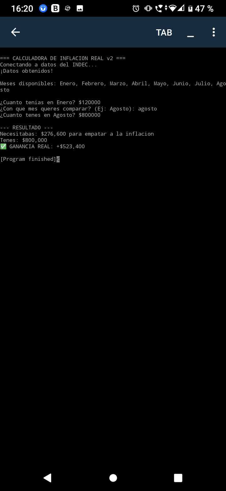
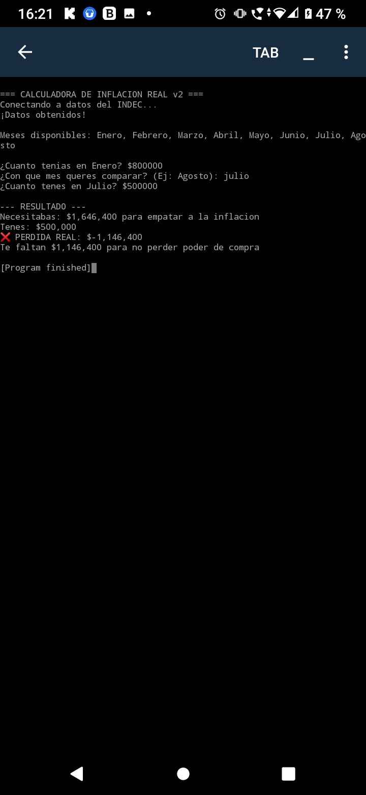

# calculadora-inflacion-argentina 🇦🇷

Calculadora en Python que mide ganancia/pérdida REAL vs IPC INDEC.

Hecho 100% desde Android con Pydroid 3 en San Francisco Solano, Buenos. Aires.

## ¿Cómo funciona?
Convierte plata nominal en poder de compra real.

## Pruebas reales de que anda:

### ✅ Le gané a la inflación

### ❌ Perdí contra la inflación

## Stack
- Pydroid 3
- GitHub Mobile
